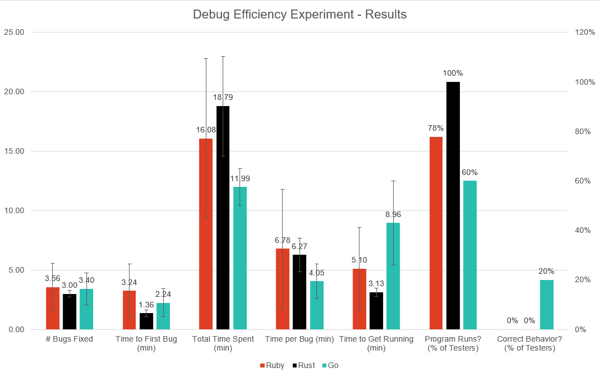
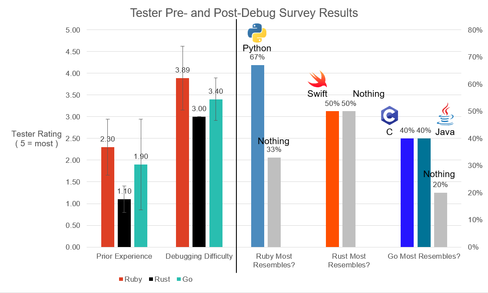

# Debug Efficiency Experiment Results

## Methods
* We implemented Game of Life in Go, Ruby, and Rust. 
* There were 5 bugs in Go, 5 bugs in Rust and 10 bugs in Ruby.
* Complexity level of bugs were from easy to medium only.
* Candidates were explained about the procedure at the beginning of the test.
* We created a Google Sheet where candidates interested could sign up for debugging trails with their preferred time slots.
* [Project Procedure](docs/test_protocol.pdf)
* While on the zoom debugging session with the candidate we made sure that the screen sharing for the candidate is enabled and recorded the session as well. This was done to ensure that the candidate is heading the right way and is not stuck doing irrelevant things.

## Materials
* Google sheet for signing up for debugging trials 
* Google form for candidates (filled before and after the debugging trials) (link)
* Evaluation sheet for each candidate
* We used repl.it for our debugging trials.
* Repl.it is a free IDE (integrated development environment) that allows users to write their own programs and code in dozens of different languages. While traditional IDEs are software programs downloaded to a computer, Repl.it is completely web browser-based and can be accessed from any internet-enabled device such as a phone, tablet, or computer. Users can access the software by typing the name directly into their browser, www.repl.it. 

## Observations

### Experimental Results
This section analyzes the results obtained from the Game of Life experiment. 

The candidates were tested on numerous metrics during the debugging sessions. Figure 1 displays the various metrics that candidates were assessed upon.
 
#### A brief description of the metric is shown below:
* \# Bugs Fixed - Average number of bugs fixed, partial fixes are not counted.
* Time to First Bug (min) - Average time taken to identify the first bug in the chosen language.
* Total Time Spent (min) - Average time spent debugging the chosen language code snippet before switching.
* Time per Bug (min) - Average time spent per bug in the chosen language.
* Time to Get Running (min) - Average time in minutes spent to launch the program and display data on the console.

#### Interesting results obtained from our analysis are provided below:
* The earliest first bug was found within 25 seconds from the start of the session in the Ruby code snippet.
* 50% of the participants attempted to debug the code in 2 programming languages, while the rest just spent most of the session debugging one code snippet.
* Only one candidate was able to resolve all the bugs in Go code snippet and obtain the correct behavior.
* 9 of the 10 participants used Google search during the debugging session.
* Only 4 participants referred to the GameofLife.awk script to refer to the flow of logic.
* 6 participants asked for hints during the active session.
* None of the participants attempted to debug in all three programming languages.

#### Important observations made during the active debugging sessions are listed below:
* Participants tended to focus on low-level issues instead of fixing prominent issues.
* A few of them seemed more focused on code syntax versus overall logic.
* Majority of them did not manage their time appropriately, and spent little time reading the code.
* A few of them spent majority of their time trying to figure out debugger on repl.it versus reading the code.
* Few of them did not pay attention to flow of logic and did not realize the start function was never called.

Figure 1: Participants were tested on numerous metrics to evaluate their debugging skills.

 

### Survey Response
During the debugging session, the participants were asked to fill out the survey and it had two portions, namely pre-test and post test.
 
As a part of the experiment, the participants were presented with three programming languages, namely Ruby, Rust and Go. They were then asked to pick at least two programming languages to be tested upon. 
 
Additionally, as a part of pre-test analysis we wanted to identify the candidates experience level in the respective programming languages. From our analysis we obtained that:
* Only one participant was not familiar with Ruby programming language.
* 90% of participants were not familiar with Rust.
* About 50% of the participants were familiar with Go programming language.

As a part of post test analysis we were primarily focused on:
* Identifying the difficulty faced by participants during the debugging phase.
* Identifying if the presented programming languages resembled any popular programming languages they were familiar with.
* Identifying which language they prefer to work/learn in future.
* Lastly, feedback to be better prepared for the future activities.

The responses from the survey are presented in Figure 2.
* Majority of the participants (6), found debugging the Ruby code extremely difficult.
* Participants found tracing the Rust and Go code was of moderate difficulty.
* Additionally, from the figure it is clear that most candidates found:
  * Ruby to have certain similarities to Python
  * Rust was compared to Swift programming language and
  * Go was considered comparable to C and Java.

Majority of the participants seemed to have a great overall test experience. Most of them appreciated the code snippets created. A few recommendations and concerns raised were:
* Recommendation to reduce the number of bugs presented during the session.
* Recommended that the code snippets could have all followed the awk script example.
* Concerns with the debugging environment as candidate was not familiar with repl.it
 
Figure 2: Participants responses from pre-test and post-test survey.

## Conclusions
* Based on a majority of our aggregated metrics, it could be argued that Go is the language that our testers had the most success debugging. Go was the only language of the three that any of the testers were able to get running with correct functionality, as well as being within the margin of error for the language with the most bugs fixed, lowest time per bug, time to first bug, and second lowest time to get running.
* With 80% of Go testers reporting that the language resembled either C or Java, contrasted with comparisons made to Python and Swift for Rust and Go respectively, it is possible that resembling a more popular language helped testers to feel more familiar with the Go code. This would be an interesting hypothesis to explore further in a follow-up study.
## Threats to Validity
* The small sample size mostly prevents us from making any real statistically significant conclusions. A greater sample size will be needed for the Week 14 experiment.
* Our Ruby code had double the number of bugs relative to our other languages, skewing all time metrics and success rates for that test. In the future we will need to ensure that our variables are more tightly controlled to allow for proper conclusions.
* In choosing to allow testers to work on any of the three languages, we ended up with many fewer data points for Rust than for Ruby and Go. For Week 14 we will need to carefully consider how much control we allow the testers to have over the experiment procedure.
* We should’ve tried doing the debugging experiments ourselves(for the codes which we did not write), so that we had some kind of benchmark to compare our results with.
